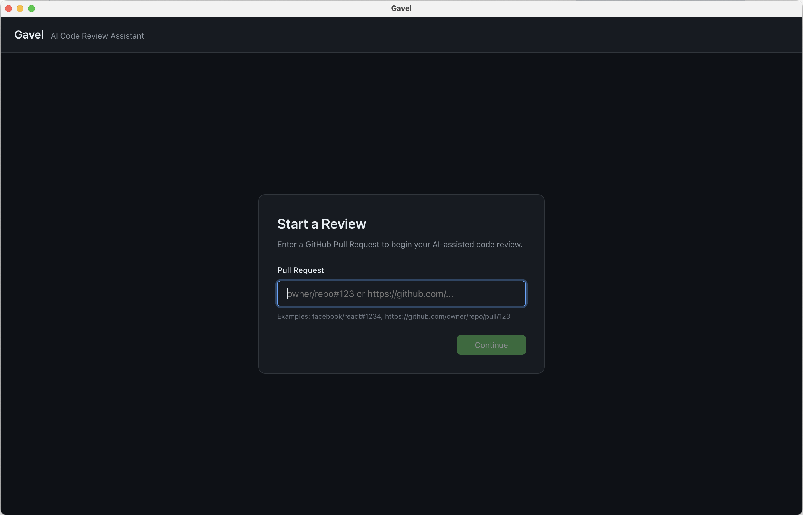

# Gavel

A local-first AI code review assistant that helps you conduct GitHub PR reviews with Claude.



## What is Gavel?

Gavel acts as a "staging area" for AI-generated code reviews. It:

1. Fetches a GitHub Pull Request
2. Analyzes the diff using Claude with your chosen review persona
3. Presents AI-generated comments for your review
4. Lets you approve, reject, or refine each comment
5. Batch-posts your approved comments to GitHub

**Key Feature:** Comments are staged locally—nothing is posted until you explicitly approve and submit.

## Prerequisites

Before using Gavel, you need:

1. **GitHub CLI (`gh`)** — for GitHub authentication and API access
   ```bash
   # macOS
   brew install gh

   # Then authenticate
   gh auth login
   ```

2. **Claude Code CLI (`claude`)** — for AI analysis
   ```bash
   # Install from https://claude.ai/code
   # Then authenticate
   claude login
   ```

## Installation

```bash
# Clone the repository
git clone https://github.com/your-org/gavel.git
cd gavel

# Install dependencies
npm install

# Run in development mode
npm run dev

# Or build for production
npm run build
```

## Usage

1. **Start Gavel** — Run `npm run dev` or launch the built app

2. **Enter a PR** — Use `owner/repo#123` format or paste a GitHub PR URL

3. **Select a Review Persona** — Choose what type of review you want:
   - **General Review** — Balanced code quality review
   - **Security Audit** — Focus on vulnerabilities (OWASP, auth, secrets)
   - **Performance Review** — Efficiency, scalability, N+1 queries
   - **Code Style** — Readability, naming, consistency

4. **Review AI Comments** — For each comment:
   - ✓ **Approve** — Mark for submission
   - ✗ **Reject** — Discard the comment
   - 💬 **Refine** — Chat with Claude to modify the comment

5. **Submit** — Post all approved comments to GitHub

## Custom Personas

Create your own review personas by adding markdown files to `~/.config/gavel/personas/`:

```markdown
---
name: My Team's Standards
description: Review against our team's coding guidelines
---

# Review Instructions

Focus on:
- Our naming conventions (camelCase for functions, PascalCase for classes)
- Required error handling patterns
- Test coverage requirements

When commenting:
- Be constructive and specific
- Reference our style guide where applicable
```

## Project Structure

```
gavel/
├── electron/           # Electron main process
│   ├── main.ts         # App entry point
│   ├── github.ts       # GitHub CLI wrapper
│   ├── claude.ts       # Claude CLI wrapper
│   └── personas.ts     # Persona loading
├── src/
│   ├── renderer/       # React frontend
│   │   ├── components/ # UI components
│   │   ├── store/      # Zustand state
│   │   └── hooks/      # React hooks
│   └── shared/         # Shared types
├── personas/           # Built-in review personas
└── package.json
```

## Development

```bash
# Run in development with hot reload
npm run dev

# Type check
npx tsc --noEmit

# Build for production
npm run build
```

## How It Works

1. **GitHub Integration** — Uses `gh` CLI to fetch PR data and post comments. Your existing `gh auth` credentials are used—no additional authentication needed.

2. **Claude Integration** — Uses `claude` CLI to analyze code. Your existing Claude Code authentication is used—no API keys required.

3. **Local-First** — All data stays local until you explicitly submit. No servers, no cloud storage.

## Troubleshooting

### "GitHub CLI not authenticated"
Run `gh auth login` and complete the authentication flow.

### "Claude CLI not found"
Install Claude Code from https://claude.ai/code and run `claude login`.

### "No comments generated"
The AI found no issues worth commenting on. Try a different persona or check the PR has meaningful changes.

### Comments not appearing on GitHub
Ensure you have write access to the repository and the PR is still open.

## License

MIT
